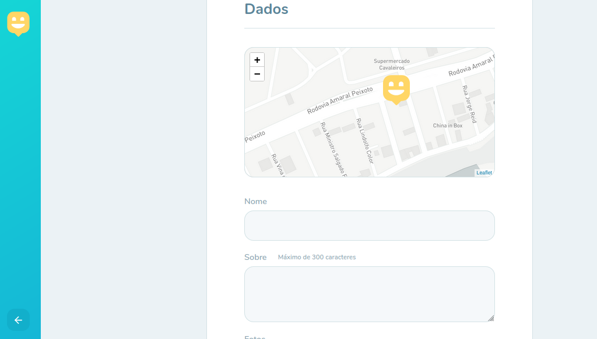
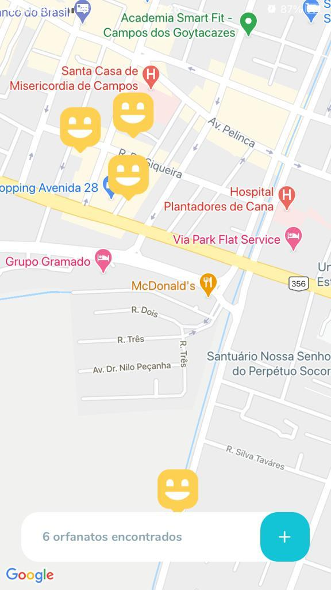
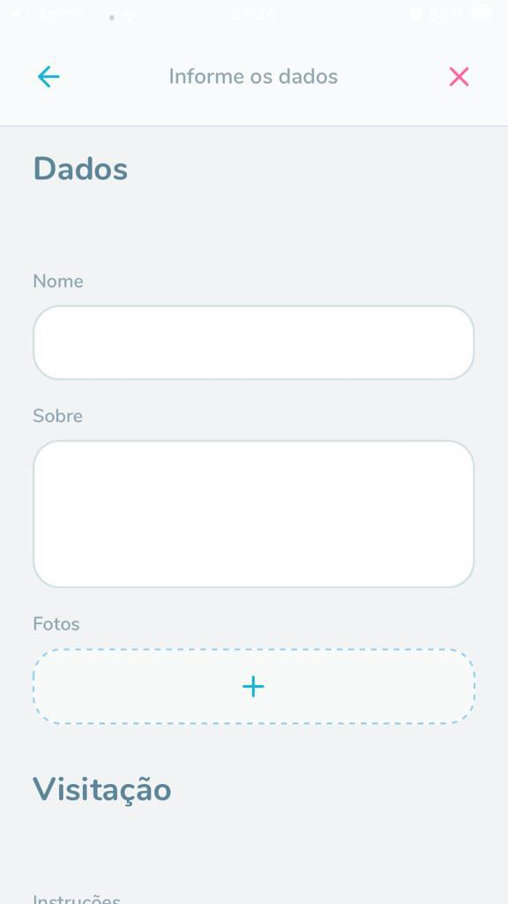

<h1 align="center">
  
</h1>

## 📌 Index

- [About](#-about)
- [Screenshots](#-screenshots)
- [Techs](#-techs)
- [How to run](#-how-to-run)
- [Contributions](#-contributions)
- [License](#-license)
- [My updates](#-my-updates)

## About

### :rocket: A app made to connect orphanages with potential visitors, using [React](https://pt-br.reactjs.org/), [Node.js](https://nodejs.org/en/) and [React Native](https://reactnative.dev/).

> This project was developed with the [@Rockeseat](https://github.com/Rocketseat) team at the Next Level Week #3.

## 📸 Screenshots

### 💻 Web

<div>
  
  
</div>

### 📱 Mobile

<div>
  
  
</div>

## 🖥 Techs

- **Web**

  - [React](https://reactjs.org/)
  - [Typescript](https://www.typescriptlang.org/)
  - [Mapbox](https://www.mapbox.com/)
  - [Leaflet](https://leafletjs.com/)
  - [React Leaflet](https://react-leaflet.js.org/)

- **Mobile**

  - [React Native](https://reactnative.dev/)
  - [Expo](https://expo.io/)

- **Backend**
  - [Nodejs](https://nodejs.org/en/)
  - [Express](https://expressjs.com/)
  - [Typeorm](https://typeorm.io/)
  - [Multer](https://github.com/expressjs/multer)
  - [Yup](https://github.com/jquense/yup)

## :construction_worker: How to run

```bash
# Clone Repository
> git clone https://github.com/jpc0rrea/nlw-happy-omnistack.git
```

### 💻 Run Web Project

```bash
> cd nlw-happy-omnistack/web

# Install Dependencies
> yarn
# or
> npm install

# run aplication
> npm run start
# or
> yarn start
```

> To execute the web project you need to have a authentication token from [Mapbox](https://www.mapbox.com/). Access your account on the website and create a token to be used in the project. With your token, create a `.env` file and put your token as the value of the` REACT_APP_MAPBOX_TOKEN` key.

Open [http://localhost:3000](http://localhost:3000) with your browser to see the result.

### 💽 Run backend

```bash
> cd nlw-happy-omnistack/backend

# Install Dependencies
> yarn
# or
> npm install

# run aplication
> npm run dev
# or
> yarn dev
```

In order to be able to run the backend with all its functionality you need to create a database with all the necessary tables. To do this, use:

```bash
> yarn typeorm migration:run

# or
> npm run typeorm migration:run
```

### 📱 Run mobile

```bash
> cd nlw-happy-omnistack/mobile

# Install Dependencies
> yarn
# or
> npm install

# run aplication
> npm run start
# or
> yarn start
```

Open [http://localhost:19002/](http://localhost:19002/), scan the QR Code with your cell phone (you must have the Expo app installed) to see the result.

## 🤝 Contributions

Follow the steps below to contribute:

1. Fork the project (<https://github.com/jpc0rrea/nlw-happy-omnistack>)

2. Clone your fork to your machine (`git clone https: // github.com / user_name / happy.git`)

3. Create a branch to perform your modification (`git checkout -b feature / name_new_feature`)

4. Add your modifications and commit (`git commit -m" Describe your modification "`)

5. Push (`git push origin feature / name_new_feature`)

6. Create a new Pull Request

7. Wait for the analysis 🚀

## 📜 License

This project is under the [MIT](./LICENSE) license.

## 🔄 My updates

- Shimmer effect on the mobile Orphanage Details page
